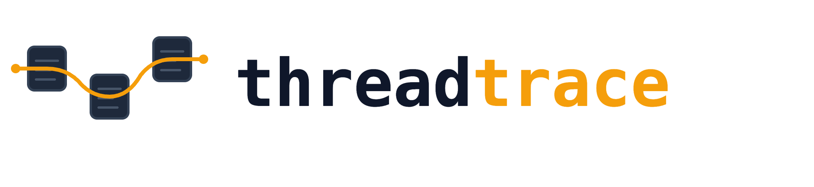
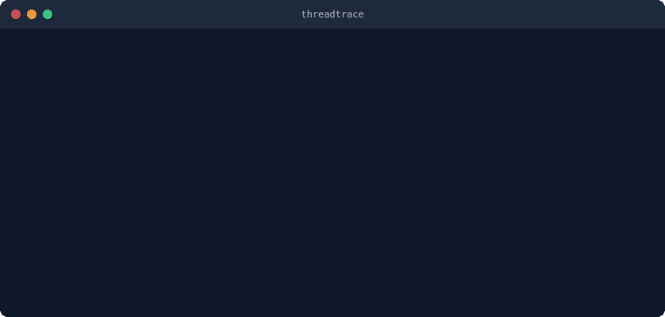

<p align="center">
  <picture>
    <source media="(prefers-color-scheme: dark)" srcset="assets/logo-dark.png">
    <source media="(prefers-color-scheme: light)" srcset="assets/logo-light.png">
    
  </picture>
</p>

<p align="center">
  <strong>Find the bugs that break production while every dashboard shows green.</strong>
</p>

<p align="center">
  <a href="LICENSE"></a>
  <a href="https://github.com/onkardahale/threadtrace/stargazers"></a>
  <a href="https://github.com/onkardahale/threadtrace"></a>
</p>

<p align="center">
  <a href="#proof">Proof</a> &middot;
  <a href="#how-it-works">How It Works</a> &middot;
  <a href="#install">Install</a> &middot;
  <a href="#when-to-use-it">When To Use It</a> &middot;
  <a href="#limitations">Limitations</a>
</p>

<p align="center">
  
</p>

## Proof

First run on a production TypeScript/Firebase/Hasura financial platform. ~50K LoC. All tests passing. Green dashboards. Zero errors in logs.

| Bug | What threadtrace found | Impact |
|-----|----------------------|--------|
| **Dead retry logic** | `.find()` with block body `{}` and no `return` — predicate always returns `undefined`, entire retry path is unreachable dead code | Every failed batch permanently loses records. No error, no log. |
| **Masked race condition** | 3 unawaited async calls hidden by the dead retry above. Fix one without the other and it gets worse. | State corruption, orphaned cloud resources |
| **Non-atomic user creation** | Insert user → set JWT claims → notify. No rollback. Firebase v1 auth triggers don't retry — verified by reading the SDK source, not the docs. | Users locked out permanently. Manual DB fix required. |
| **Claims overwrite landmine** | `setCustomUserClaims` OVERWRITES all claims (doesn't merge) — discovered by reading the Firebase SDK source in `node_modules/`, not the documentation. | Dormant bug waiting for a future developer to activate. |

6 confirmed bugs across 3 seeds. All findings independently verified by a separate agent with no knowledge of how the bugs were discovered — no rejected hypotheses in this dataset.

## Why Nothing Else Catches These

Linters check syntax. Type checkers check types. Tests check the paths you thought to test.

None of them trace what actually happens when a database write fails at 3 AM — through your error handler, into the retry logic, across the library boundary, and back up to the caller that assumes success.

And none of them read library source code. Engineers rely on documentation contracts, but production behavior follows implementation reality. Docs are simplified. SDKs evolve. Edge cases become default paths under failure conditions. Documentation says `setCustomUserClaims` "sets claims" — the implementation **overwrites all existing claims**. Documentation says Firebase auth triggers "handle errors" — the v1 SDK **does not retry on failure**.

threadtrace reads the actual code in `node_modules/`. That's how it finds bugs that exist in the gap between what you think a library does and what it actually does.

## How It Works

Most AI tools find bugs by convincing themselves they're right. threadtrace forces a second agent to try to prove them wrong.

Three phases:

1. **Discover** — Scout maps the codebase by damage potential. Tracer follows error paths end-to-end, across files, into library source in `node_modules/`. Documents behavior neutrally without judging. Pattern Architect compares against sibling functions and git history.

2. **Hypothesize** — Orchestrator synthesizes traces into structured hypotheses: specific mechanism, downstream effect, blast radius, confidence score, and a concrete 1-3 line fix.

3. **Adversarial Verify** — A separate agent instance receives only the hypothesis and file paths. No discovery context, no confidence scores, no evidence. Default stance: the code is correct. It tries to disprove the hypothesis. If it can't, it writes a test case.

The judge literally cannot access the discovery context because it was never provided. This isn't a prompt trick — it's architectural. [Full methodology →](METHODOLOGY.md)

## Install

```bash
git clone https://github.com/onkardahale/threadtrace.git ~/.claude/plugins/threadtrace
```

Then start Claude Code with the plugin:

```bash
claude --plugin-dir ~/.claude/plugins/threadtrace
```

## Run

Most users start with a specific concern:

```bash
# Investigate a specific suspicion
/threadtrace:threadtrace "what happens when the payment write fails?"

# Verify a specific claim
/threadtrace:threadtrace-verify "the retry in queue.ts never fires"

# Quick single-path trace (no verification)
/threadtrace:threadtrace-trace "src/handlers/payment.ts error path"
```

Auto mode scans the codebase and picks the highest-risk path:

```bash
/threadtrace:threadtrace
```

## When To Use It

**threadtrace works best when:**

- Code has async boundaries, retries, or multi-step operations
- Error handling paths exist but aren't well tested
- Behavior depends on library internals (SDKs, ORMs, queue libraries)
- You suspect something is silently wrong but can't pinpoint it

**Less effective for:**

- Pure algorithmic bugs (wrong formula, off-by-one)
- UI-only logic with no backend interactions
- Systems with exhaustive integration test coverage

## Persistent Memory

Findings, learned patterns, and verified library behaviors persist to `.claude/threadtrace/` in the target project. The second run skips known issues, avoids known false positive patterns, and starts from what was learned in the first. Each run compounds on the last.

Memory is local to the project and can be cleared at any time by deleting `.claude/threadtrace/`.

## Limitations

- Currently optimized for TypeScript/Node.js codebases (seed catalog)
- Requires Claude Code (uses multi-agent subagent spawning)
- Each full investigation uses ~50-100K tokens across agents
- Does not execute code — reconstructs execution paths from source, including library internals
- Confidence calibration is based on limited production runs
- Not a replacement for tests — finds the bugs you didn't know to test for

## License

MIT
